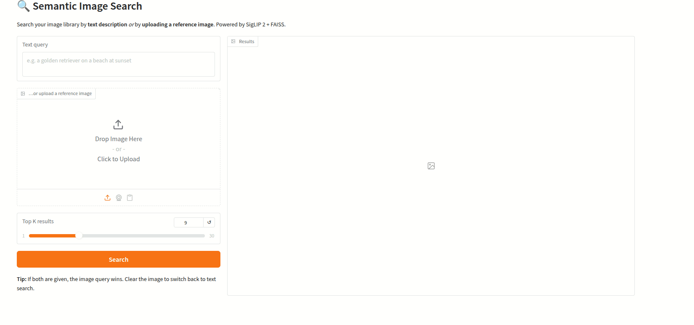

# 🔍 Semantic Image Search with SigLIP 2

A tiny, production-shaped image search engine that lets you query a folder of images **either by natural-language description or by uploading a reference image**. Built on Google's **SigLIP 2** (Feb 2025) embeddings and **FAISS** for millisecond retrieval.



## Why this project

Most "image search" tutorials still use CLIP (2021). SigLIP 2 trains with a **sigmoid loss**, scales much better with batch size, and beats CLIP on almost every zero-shot retrieval benchmark — especially for multilingual queries and fine-grained concepts. Swapping the backbone is a one-line change, but the downstream quality jump is large.

## Real-world use cases

- **Creative teams** — search a 50k-image asset library by vibe ("moody industrial interior, soft light").
- **E-commerce** — "visual search" where shoppers upload a photo and get similar products.
- **Lost & found / reunification** — describe a missing pet or item instead of scrolling.
- **Dataset hygiene** — find near-duplicates or mislabeled samples before training.

## Architecture

```
images/         ┐
                ├──► SigLIP 2 image encoder ──► FAISS IndexFlatIP ──┐
                ┘                                                   │
text query ─────► SigLIP 2 text encoder ───────────────────────────►│── top-k results
image query ────► SigLIP 2 image encoder ──────────────────────────►│
```

Both text and images map to the **same 768-d unit-sphere embedding space**, so cosine similarity works across modalities without any extra training.

## Install

```bash
git clone <your-repo>
cd Semantic-Image-Search-with-SigLIP-2
python -m venv .venv && source .venv/bin/activate
pip install -r requirements.txt
```

## Usage

### 1. Index a folder of images

```bash
python indexer.py --images /path/to/images --out index_data
```

Recursive, skips unreadable files, and saves `index.faiss` + `paths.txt`.

### 2. Launch the UI

```bash
python app.py --index index_data
```

Open the printed URL. Type a query or drop an image in.

### 3. Or use it from Python

```python
from search import ImageSearchEngine

eng = ImageSearchEngine()
eng.load("index_data")

for path, score in eng.search_text("red vintage car in the rain", k=5):
    print(f"{score:.3f}  {path}")
```

## Model choices

| Model | Size | Quality | Speed |
|---|---|---|---|
| `google/siglip2-base-patch16-256` *(default)* | ~375M | good | fast |
| `google/siglip2-so400m-patch14-384` | ~1.1B | best | slower, needs GPU |
| `google/siglip-base-patch16-256` | — | old baseline | — |

Swap with `--model <hf-id>` on both `indexer.py` and `app.py`.

## Improvement over typical portfolio versions

Most portfolios ship a CLIP + FAISS flat index. This repo adds:

1. **SigLIP 2 backbone** — materially better retrieval quality, better multilingual support.
2. **Unified text + image querying** from the same endpoint.
3. **L2-normalized vectors + inner-product index** — mathematically equivalent to cosine but ~2× faster than `IndexFlatL2` for the same result.
4. **Clean separation** of `encode / index / query` so you can drop in Qdrant or Milvus when you outgrow FAISS.

## Roadmap

- [ ] Swap `IndexFlatIP` for `IndexIVFPQ` for >1M images.
- [ ] Add DINOv2 as a second vector for fine-grained visual similarity (hybrid rerank).
- [ ] Cross-encoder reranker on top-50 for higher precision@1.
- [ ] Build a CSV-based metadata filter (date, tags, camera).

## License
MIT.